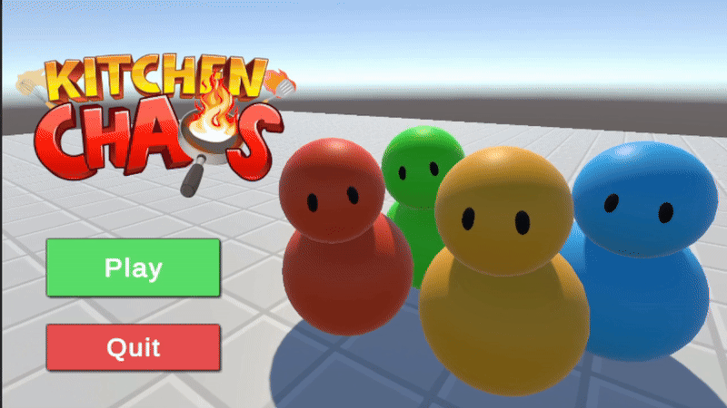
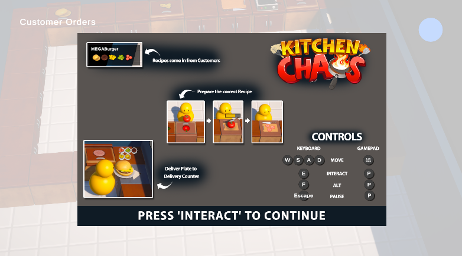
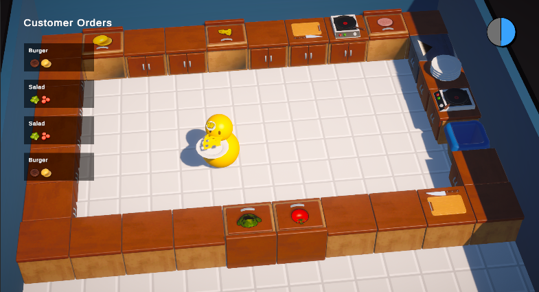
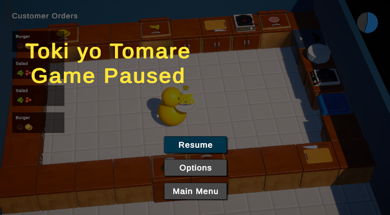
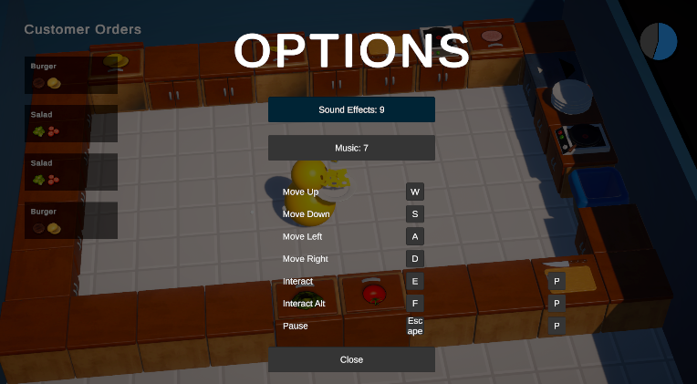
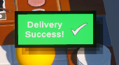
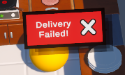
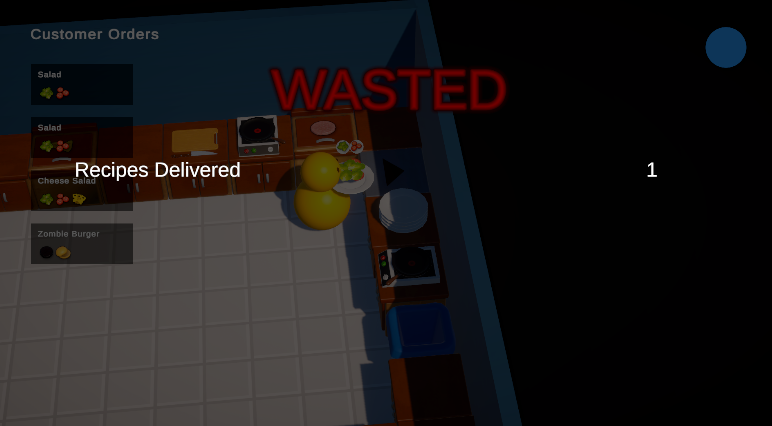

# 👨‍🍳 Kitchen Chaos 

<h4 align="center">
  <a href="#key-features">Features</a> ·
  <a href="#gameplay-preview">Preview</a> ·
  <a href="#technical-highlights">Technical Details</a> ·
  <a href="#getting-started">Getting Started</a>
</h4>

---
Kitchen Chaos is my first complete Unity game project, developed by following CodeMonkey's comprehensive tutorial. This project was specifically chosen as it emphasizes writing clean, maintainable, and industry-standard code rather than quick prototypes. The focus is on learning professional game development practices and proper software architecture.

## ⭐ Key Features
- **Fast-paced Cooking Action**: Manage multiple recipes simultaneously under time pressure
- **Complete Game Loop**: From main menu to game over screen with score tracking
- **Polished UI/UX**: Including pause menu, options, and tutorial screens
- **Customizable Controls**: Fully rebindable keyboard and gamepad inputs
- **Audio System**: Background music and sound effects with adjustable volumes

## 🎮 Gameplay Preview
| Feature | Screenshot |
|---------|------------|
| Main Menu |  |
| Tutorial |  |
| Gameplay |  |
| Pause Screen |  |
| Options & Keybinds |  |
| Successful Delivery |  |
| Failed Delivery |  |
| End Screen |  |

## 🔧 Technical Highlights
This project implements numerous advanced Unity and C# concepts:
- **State Machine Pattern**: Robust game state management
- **Singleton Pattern**: Efficient manager classes
- **C# Events & Interfaces**: Clean communication between components
- **Scriptable Objects**: Flexible data management
- **Input System**: Modern Unity input handling
- **Shader Graph**: Custom visual effects
- **Cinemachine**: Professional camera control
- **Post Processing**: Enhanced visual quality
- **Scene Management**: Proper loading and transitions

## ⌨️ Controls
- **WASD**: Movement
- **E**: Interact
- **F**: Perform Actions
- **ESC**: Options Menu
All controls are fully configurable through the Options Menu!

## 🚀 Getting Started
1. Clone this repository
2. Open with Unity Hub v2021.3.3.8f1
3. Open the main scene in Assets/Scenes
4. Press Play to run in editor

## 🙏 Acknowledgments
This project was developed by following CodeMonkey's excellent tutorials  
- [Tutorial on his Website](https://unitycodemonkey.com/kitchenchaoscourse.php) 
- [Tutorial on his Youtube Channel](https://www.youtube.com/watch?v=AmGSEH7QcDg) 

Thank you Mr Monkey!

## 📝 License
This project is for educational purposes and follows CodeMonkey's tutorial guidelines. All assets and original code concepts belong to their respective owners.
